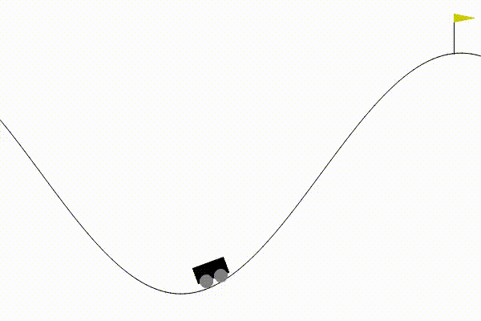

# rl_classic_algorithms
Classic RL algorithms (*Sutton-Barto: Reinforcement Learning An Introduction*) for Gym classic control environments with continuous state space and discrete action space.

## Environments

- *mountain car* - to accelerate a car in order to reach the top of a hill (two-dimensional 
continuous observation space, three discrete actions)
- *cart pole* - to balance a pole by applying forces on the cart (four-dimensional
continuous observation space, two discrete actions)
- *acrobot* - to swing the free end of a chain above the given line (six-dimensional
continuous observation space, three discrete actions)

## Algorithms

A set of algorithms is provided - some of them are given in two versions (for two
different representations of value functions).

| algorithm | tabular Q | linear approx Q | linear approx V and π |
|:----------:|:--------:|:---------------:|:----------------------:|
| sarsa      |    Y     |        Y        |                        |
| qlearning  |    Y     |        Y        |                        |
| expected sarsa | Y    |        Y        |                        |
| sarsa(n)   |    Y     |        Y        |                        |
| sarsa(λ)   |    Y    |        Y    |                        |
| one step actor critic |     |           |         Y              |
| dynaq      |    Y     |        Y        |                        |

## Coding state space

Since the state space is continuous, states should be discretized into the form of a set of features.
The following state space coding methods are available:

- *aggregating coding* (selection `"aggregating"` or `"aggregating_simple"`) - dividing state space into separate bins
- *tile coding* (selection `"tile"` or `"tile_simple"`) - using several grids shifted towards each other
- *rbf coding* (selection `"rbf"` or `"rbf_simple"`) - defining a set of centers with subsequent measuring distances to these centers
- *fourier coding* (selection `"fourier"` or `"fourier_simple"`) - normalizing state space with subsequent use of *cos* functions

Selections `"*_simple"` treat each dimension in separation - multi-dimensional state space is considered as a combination of one-dimensional spaces. The other selections treat the state space in real multi-dimensional manner (but generate more features than the previous approach).  

Coding is controlled by `"granularity"` of the form of a list [n1, n2] where ni belongs to the i-th dimension of the state space and defines number of bins, centers or functions along the given dimension.

| method | type of features | # of features | # of features (simple)          |
|:-------:|:----------------:|:----:|:---:|
| aggregating | binary / indexes | n1 * n2 | n1 + n2 |
| tile | binary / indexes | n1 * n2 * #_of_tilings | (n1 + n2) * #_of_tilings  |
| rbf  | real-valued | n1 * n2 | n1 + n2 |
| fourier | real-valued | n1 * n2  | n1 + n2 - 1 |

Only coding methods producing indexes can be combined with tabular representation. Linear approximate representation can be combined with all provided coding methods.

## Exploration policy

Three types of exploration policies are available for algorithms learning action value function **Q** (algorithms for learning target policy **π** directly use this learned policy), :
- *ε-greedy* (selection `"epsilon_greedy"`) - with probability 1-ε is selected the action with the highest Q value, with probability ε is selected random action
- *softmax* (selection `"softmax"`) - actions are selected with probabilities given by their **Q** values 
- *max Boltzmann* (selection `"max_boltzmann"`) - with probability 1-ε is selected the action with the highest Q value, with probability ε are actions selected with probabilities given by their Q values

## Test scripts

All test scripts imports `config.py` defining default values for all parameters (exploration related,
observation space coding related and algorithm related). Test scripts can use these values as they are, modify them or duplicate them into different settings.

### Action map 
- script `action_map.py`
- mapping from observation space to action space (which action corresponds to which part of observation space)
- action selection is based on the function that is learned (action value function or policy function)
- available only for two-dimensional observation space (i.e. for *mountain car* environment only)

### Grid search
- script `parameter_setting.py`
- comparing performance of different values of one or two tested parameters
- performance is calculated as average performance (average number of steps) per episode, but skipping a given number of episodes at the beginning of a run
- to overcome stochastic nature, a given number of runs is averaged
- available for all environments

### Learning progress
- script `comparison.py`
- documents how performance (number of steps per episode) changes along episode progression
- one or more graphs can be included - different graphs can represent different algorithms or one algorithm with different value settings (or mix of both)
- to overcome stochastic nature, a given number of runs is averaged
- available for all environments

### Animation
- script `episode_animation.py`
- available only for Gym version up to 22 (based on Monitor wrapper which was removed in version 23)

